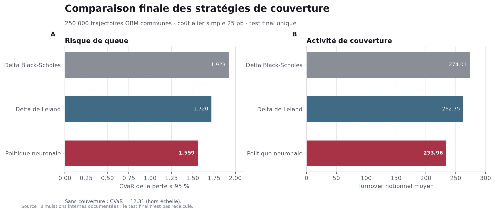
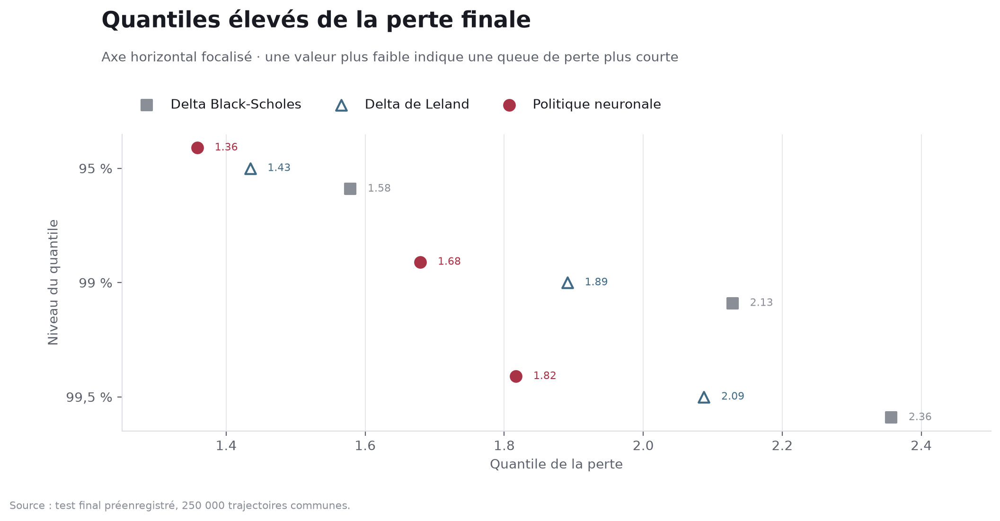
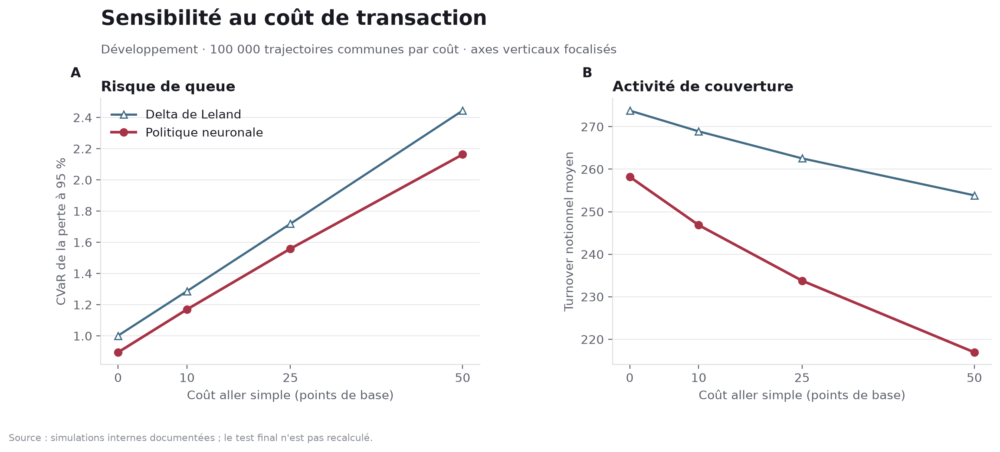
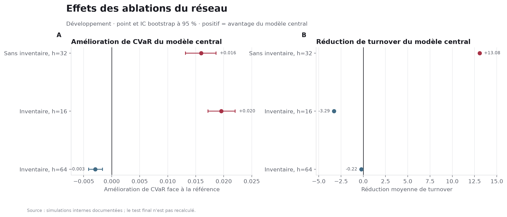
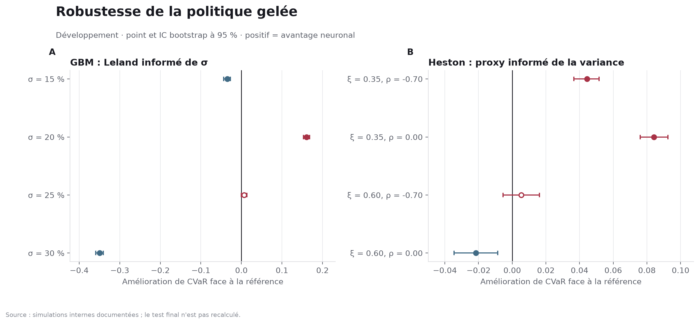

::: {.callout-note title="Statut et portée"}
Ce document est un **rapport technique de projet**, et non un article évalué par les pairs. Les données sont entièrement simulées. Les résultats décrivent une expérience contrôlée de couverture d'un call européen ; ils ne constituent ni une stratégie de négociation, ni une recommandation financière, ni une preuve de performance en marché réel.
:::

```{python}
#| label: setup
#| include: false

from pathlib import Path
import hashlib
import json

from IPython.display import Markdown, display


def locate_root() -> Path:
    for candidate in [Path.cwd(), *Path.cwd().parents]:
        if (candidate / "benchmarks" / "final-test-results.json").exists():
            return candidate
    raise FileNotFoundError("Dossier scientifique introuvable")


def sha256(path: Path) -> str:
    return hashlib.sha256(path.read_bytes()).hexdigest()


def md_table(headers, rows, numeric_columns=()):
    def clean(value):
        return str(value).replace("|", "\\|").replace("\n", " ")

    aligns = [("---:" if index in numeric_columns else "---") for index in range(len(headers))]
    lines = [
        "| " + " | ".join(clean(item) for item in headers) + " |",
        "| " + " | ".join(aligns) + " |",
    ]
    lines.extend("| " + " | ".join(clean(item) for item in row) + " |" for row in rows)
    display(Markdown("\n".join(lines)))


ROOT = locate_root()
BENCHMARKS = ROOT / "benchmarks"
FIGURES = ROOT / "figures" / "generated"

paths = {
    "final": BENCHMARKS / "final-test-results.json",
    "cost": BENCHMARKS / "cost-sensitivity.json",
    "volatility": BENCHMARKS / "frequency-volatility.json",
    "heston": BENCHMARKS / "heston-parameter-sensitivity.json",
    "ablations": BENCHMARKS / "model-ablations.json",
}
manifest = json.loads((FIGURES / "manifest.json").read_text(encoding="utf-8"))
for key, path in paths.items():
    assert sha256(path) == manifest["source_hashes"][key]

final_result = json.loads(paths["final"].read_text(encoding="utf-8"))
opening = json.loads((BENCHMARKS / "final-test-opening.json").read_text(encoding="utf-8"))
assert sha256(paths["final"]) == "966e7ddaf7e546d60e95ae4fbf4d5adc7c1f4ad6978f1ba06d7e35fdf7cabcc3"
assert opening["status"] == "completed"
assert opening["output_sha256"] == sha256(paths["final"])
assert final_result["confirmatory_decision"]["favorable"] is True

cost_data = json.loads(paths["cost"].read_text(encoding="utf-8"))
volatility_data = json.loads(paths["volatility"].read_text(encoding="utf-8"))
heston_data = json.loads(paths["heston"].read_text(encoding="utf-8"))
ablation_data = json.loads(paths["ablations"].read_text(encoding="utf-8"))
comparisons = final_result["paired_comparisons"]
```

# Résumé

Ce projet étudie la couverture discrète d'une position courte sur un call européen en présence de coûts de transaction proportionnels. Une politique neuronale compacte est entraînée pour minimiser la Conditional Value-at-Risk (CVaR) à 95 %, puis comparée à une delta Black--Scholes et à une delta ajustée selon Leland. Le protocole sépare apprentissage, validation, développement et test final ; la politique et le critère confirmatoire ont été gelés avant l'ouverture unique de 250 000 trajectoires finales.

Dans le scénario central simulé - mouvement brownien géométrique, volatilité de 20 %, 30 rééquilibrages et coût aller simple de 25 points de base - la politique neuronale atteint une CVaR de **1,5586**, contre **1,7202** pour Leland. L'amélioration appariée vaut **0,1615**, avec un intervalle bootstrap à 95 % de **[0,1565 ; 0,1664]**. Le turnover diminue de **28,79**, soit 10,96 %. En contrepartie, l'écart-type du P&L neuronal est supérieur de 14,00 % à celui de Leland.

Le résultat central indique donc un déplacement du compromis vers la queue de perte ciblée et vers une négociation moins intense, non une domination selon toutes les mesures de risque. Les sensibilités confirment que l'avantage n'est pas universel : une référence informée dépasse le réseau sous certaines volatilités et dans un scénario Heston défavorable.

# Question et contribution

La question principale est la suivante :

> Pour une position courte sur un call européen, une politique de couverture apprise par réseau de neurones et optimisée selon la CVaR réduit-elle les pertes extrêmes hors échantillon par rapport à une couverture delta discrète, à coût de transaction donné ?

La contribution n'est pas un nouvel algorithme de deep hedging. Elle réside dans quatre choix expérimentaux :

1. une convention de coût et de P&L explicitée avant l'apprentissage ;
2. une comparaison appariée entre stratégies sur les mêmes trajectoires ;
3. un test final préenregistré, ouvert une seule fois après gel du modèle ;
4. la conservation des résultats défavorables dans les analyses de robustesse.

Cette séparation est importante car l'évaluation répétée sur le jeu final transformerait progressivement celui-ci en jeu de développement.

# Cadre scientifique

## Couverture avec frictions

Le cadre Black--Scholes fournit un prix et une delta de référence sous des hypothèses idéales de marché complet et sans friction [@black1973pricing]. Dès que chaque variation de position est facturée, la réplication continue devient irréalisable et la fréquence de rééquilibrage influence directement le coût [@leland1985transactions].

Pour une position courte sur le call, la politique détient $h_t$ unités du sous-jacent entre les dates $t$ et $t+1$. Avec une prime initiale $\pi_0$, un coût aller simple $c$ et une liquidation terminale, le P&L utilisé est

$$
\Pi_T
=
\pi_0
+ \sum_{t=0}^{N-1} h_t(S_{t+1}-S_t)
- c\left[
S_0|h_0|
+ \sum_{t=1}^{N-1}S_t|h_t-h_{t-1}|
+ S_T|h_{N-1}|
\right]
-(S_T-K)^+.
$$

La prime Black--Scholes est commune aux stratégies d'une même comparaison. Cette convention isole l'effet de la couverture au lieu de confondre performance de la politique et prix initial différent.

## Référence de Leland

L'ajustement de Leland augmente la volatilité utilisée dans la delta afin de tenir compte de la friction. Si $c$ désigne ici un coût aller simple, la volatilité ajustée pour un call convexe est

$$
\sigma_L
=
\sigma\sqrt{
1+\sqrt{\frac{8}{\pi}}
\frac{c}{\sigma\sqrt{\Delta t}}
}.
$$

La conversion par le facteur deux entre coût aller simple et coût aller-retour est conservée dans le code et couverte par un test unitaire. Leland reste une approximation asymptotique et une référence classique, non une stratégie optimale universelle.

## Objectif de risque

La perte est $L=-\Pi_T$. Pour $\alpha=95\%$, la représentation de Rockafellar--Uryasev [@rockafellar2000cvar] s'écrit

$$
\operatorname{CVaR}_{\alpha}(L)
=
\min_{\eta}
\left[
\eta+\frac{1}{1-\alpha}
\mathbb{E}\{(L-\eta)_+\}
\right].
$$

Cette fonction cible la moyenne de la queue défavorable. Elle ne minimise pas la variance. Le rapport examine donc séparément CVaR, VaR, écart-type, probabilité de perte, coût et turnover.

Les réseaux d'apprentissage sont utilisés depuis longtemps pour approximer prix et couvertures [@hutchinson1994learning]. Le deep hedging étend cette idée à des politiques séquentielles sous frictions, contraintes et mesures convexes du risque [@buehler2019deep]. Le présent projet reprend ce principe dans un cadre volontairement compact afin de rendre les mécanismes et les limites auditables.

# Protocole expérimental

## Marché simulé

Le scénario principal utilise un mouvement brownien géométrique sous la mesure risque-neutre :

$$
dS_t = rS_t\,dt+\sigma S_t\,dW_t,
\qquad r=0.
$$

```{python}
#| label: tbl-protocole
#| tbl-cap: "Paramètres du scénario confirmatoire"

market = final_result["market"]
evaluation = final_result["evaluation"]
md_table(
    ["Paramètre", "Valeur"],
    [
        ["Sous-jacent initial", f"{market['s0']:.0f}"],
        ["Strike", f"{market['strike']:.0f}"],
        ["Échéance", f"{market['maturity']:.6f} année"],
        ["Volatilité", f"{100 * market['sigma']:.0f} %"],
        ["Rééquilibrages", f"{market['n_steps']}"],
        ["Coût aller simple", f"{10_000 * evaluation['one_way_cost']:.0f} pb"],
        ["Niveau de CVaR", f"{100 * evaluation['alpha']:.0f} %"],
        ["Trajectoires finales", f"{evaluation['size']:,}".replace(",", " ")],
        ["Réplications bootstrap", f"{evaluation['bootstrap_replicates']:,}".replace(",", " ")],
    ],
)
```

Les trajectoires sont simulées et ne sont jamais présentées comme des observations de marché.

## Stratégies

Quatre stratégies sont évaluées :

- **sans couverture**, contrôle minimal ;
- **delta Black--Scholes**, recalculée à chaque date ;
- **delta de Leland**, calculée avec $\sigma_L$ ;
- **politique neuronale**, réseau partagé dans le temps.

La politique neuronale comprend deux couches cachées de 32 neurones SiLU, soit 1 217 paramètres. Son état contient la log-moneyness, le temps restant et la position précédente. La sortie est bornée dans $[0;1{,}25]$. L'inventaire précédent donne au réseau l'information nécessaire pour arbitrer entre correction de la couverture et coût d'un nouvel ordre.

## Séparation et gel

L'entraînement renouvelle les trajectoires à chaque époque. Un jeu de validation sélectionne le checkpoint, puis un jeu de développement distinct sert aux sensibilités et ablations. La durée maximale est fixée à 2 000 époques ; le meilleur état est choisi sur la validation.

Le test final emploie la graine 20269000 et 250 000 trajectoires. Le checkpoint, l'architecture, le coût, la fréquence, les métriques et les graines bootstrap ont été gelés avant sa génération. L'artefact final est associé à l'empreinte SHA-256

> 966e7ddaf7e546d60e95ae4fbf4d5adc7c1f4ad6978f1ba06d7e35fdf7cabcc3

Les intervalles sont obtenus par bootstrap apparié [@efron1979bootstrap] : chaque réplication rééchantillonne les indices communs aux pertes des deux stratégies. Ils décrivent l'incertitude Monte-Carlo conditionnelle à la politique apprise, pas toute la variabilité d'optimisation entre graines.

# Résultats confirmatoires

## Risque et P&L

```{python}
#| label: tbl-risque-final
#| tbl-cap: "Risque final sur 250 000 trajectoires"

labels = {
    "unhedged": "Sans couverture",
    "black_scholes_delta": "Delta Black--Scholes",
    "leland_delta": "Delta de Leland",
    "neural_policy": "Politique neuronale",
}
risk_rows = []
for key, label in labels.items():
    metric = final_result["strategy_metrics"][key]
    risk_rows.append([
        label,
        f"{metric['mean_pnl']:.4f}",
        f"{metric['std_pnl']:.4f}",
        f"{metric['var_loss_95']:.4f}",
        f"{metric['cvar_loss_95']:.4f}",
    ])
md_table(["Stratégie", "P&L moyen", "Écart-type", "VaR 95 %", "CVaR 95 %"], risk_rows, (1, 2, 3, 4))
```

```{python}
#| label: tbl-activite-finale
#| tbl-cap: "Pertes et activité de couverture"

activity_rows = []
for key, label in labels.items():
    metric = final_result["strategy_metrics"][key]
    activity_rows.append([
        label,
        f"{100 * metric['loss_probability']:.2f} %",
        f"{metric['mean_transaction_cost']:.4f}",
        f"{metric['mean_turnover_notional']:.2f}",
    ])
md_table(["Stratégie", "Probabilité de perte", "Coût moyen", "Turnover"], activity_rows, (1, 2, 3))
```

{#fig-comparaison-finale fig-alt="Deux barres comparatives montrent que la politique neuronale a la CVaR et le turnover les plus faibles parmi les trois couvertures."}

La delta Black--Scholes réduit fortement la dispersion et la CVaR par rapport à l'absence de couverture, ce qui constitue un contrôle de cohérence. Leland améliore ensuite la CVaR de 1,9230 à 1,7202 et réduit légèrement les transactions.

La politique neuronale atteint une CVaR de 1,5586. Le critère préenregistré compare la CVaR de Leland à celle du réseau :

$$
\Delta_{\mathrm{CVaR}}
=
\operatorname{CVaR}_{95\%}(L_{\mathrm{Leland}})
-
\operatorname{CVaR}_{95\%}(L_{\mathrm{réseau}}).
$$

```{python}
#| label: tbl-comparaisons
#| tbl-cap: "Comparaisons appariées finales"

comparison_specs = [
    ("cvar_neural_versus_leland", "CVaR : réseau vs Leland"),
    ("cvar_neural_versus_delta", "CVaR : réseau vs delta"),
    ("cost_neural_versus_leland", "Coût : réseau vs Leland"),
    ("turnover_neural_versus_leland", "Turnover : réseau vs Leland"),
]
rows = []
for key, label in comparison_specs:
    result = comparisons[key]
    rows.append([
        label,
        f"{result['point_improvement']:.4f}",
        f"{result['ci_lower']:.4f}",
        f"{result['ci_upper']:.4f}",
    ])
md_table(["Comparaison", "Amélioration", "IC 95 % bas", "IC 95 % haut"], rows, (1, 2, 3))
```

L'amélioration de CVaR face à Leland vaut **0,1615**, IC 95 % **[0,1565 ; 0,1664]**. Sa borne inférieure étant positive, le critère confirmatoire est satisfait dans le scénario central. La réduction relative atteint 9,39 %. Face à la delta Black--Scholes, la réduction relative de CVaR atteint 18,95 %.

Le coût moyen et le turnover diminuent de 10,96 % face à Leland. Cette égalité des pourcentages vient de la convention de coût proportionnel fixe : le coût cumulé est directement proportionnel au turnover notionnel.

## Forme de la queue

{#fig-quantiles fig-alt="Graphique à points des quantiles 95, 99 et 99,5 pour cent : les pertes de queue de la politique neuronale restent sous celles des deltas Black-Scholes et Leland."}

```{python}
#| label: tbl-quantiles
#| tbl-cap: "Quantiles élevés de la perte"

tail_rows = []
for key in ("black_scholes_delta", "leland_delta", "neural_policy"):
    q = final_result["strategy_metrics"][key]["loss_quantiles"]
    tail_rows.append([labels[key], f"{q['q95']:.4f}", f"{q['q99']:.4f}", f"{q['q995']:.4f}"])
md_table(["Stratégie", "Q95", "Q99", "Q99,5"], tail_rows, (1, 2, 3))
```

Le réseau obtient les quantiles les plus faibles aux trois niveaux. Toutefois, son écart-type de P&L vaut 0,5439 contre 0,4771 pour Leland, soit **14,00 % de plus**. L'objectif CVaR a donc déplacé le risque loin de la queue défavorable sans réduire toute la dispersion. Présenter la stratégie comme globalement « moins risquée » serait imprécis.

# Mécanismes appris

## Coût de transaction

Une politique distincte a été entraînée pour chaque coût de développement. Quand le coût passe de 0 à 50 points de base, le turnover neuronal diminue de 258,20 à 216,93. La stratégie apprend donc à rendre la couverture plus inerte lorsque chaque ordre devient plus cher.

{#fig-couts fig-alt="Deux courbes de développement selon le coût de transaction montrent une CVaR croissante mais un turnover décroissant, avec des valeurs neuronales inférieures à Leland aux quatre coûts."}

```{python}
#| label: tbl-couts
#| tbl-cap: "Sensibilité au coût sur le jeu de développement"

cost_rows = []
for scenario in cost_data["scenarios"]:
    neural = scenario["development_metrics"]["neural"]
    leland = scenario["development_metrics"]["delta_leland"]
    comparison = scenario["paired_bootstrap_versus_leland"]
    cost_rows.append([
        f"{scenario['basis_points']}",
        f"{neural['cvar_loss_95']:.4f}",
        f"{leland['cvar_loss_95']:.4f}",
        f"{comparison['point_improvement']:.4f}",
        f"{neural['mean_turnover_notional']:.2f}",
    ])
md_table(["Coût (pb)", "CVaR réseau", "CVaR Leland", "Gain CVaR", "Turnover réseau"], cost_rows, (0, 1, 2, 3, 4))
```

La CVaR augmente néanmoins avec le coût : négocier moins limite la friction, mais ne la supprime pas. Le réseau reste meilleur que Leland sur les quatre points de la grille ; cette observation ne justifie aucune extrapolation hors de 0 à 50 points de base.

## Rôle de l'inventaire

Retirer la position précédente de l'état augmente la CVaR de 0,0160, IC 95 % [0,0132 ; 0,0186], et le turnover de 13,08, IC [13,03 ; 13,13]. L'inventaire transmet donc une information utile sur le coût marginal d'un changement de position.

Réduire le réseau à 353 paramètres dégrade la CVaR de 0,0195. L'augmenter à 4 481 paramètres améliore la CVaR de seulement 0,0029, soit environ 0,19 %, pour 3,7 fois plus de paramètres. Le réseau central de 1 217 paramètres est retenu par parcimonie, et non parce qu'il serait la capacité universellement optimale.

{#fig-ablations fig-alt="Intervalles de confiance des effets d'ablation : retirer l'inventaire dégrade CVaR et turnover, tandis qu'un réseau plus grand apporte un petit gain de CVaR au modèle alternatif."}

# Robustesse et résultats défavorables

## Changement de volatilité

La politique centrale est entraînée à 20 %. Lorsqu'elle est évaluée à d'autres volatilités, la comparaison dépend de l'information accordée à la référence. La figure suivante utilise une delta de Leland informée de la volatilité réelle du scénario.

{#fig-robustesse fig-alt="Intervalles de confiance des améliorations de CVaR : l'avantage neuronal change de signe selon la volatilité GBM et devient négatif dans un scénario Heston à forte volatilité de variance sans levier."}

```{python}
#| label: tbl-robustesse
#| tbl-cap: "Robustesse face à une référence informée"

def interpretation(low, high):
    if low > 0:
        return "avantage réseau"
    if high < 0:
        return "avantage référence"
    return "indistinct à 95 %"


robustness_rows = []
for scenario in volatility_data["volatility_experiment"]["scenarios"]:
    result = scenario["paired_bootstrap_neural_versus_informed_leland"]
    robustness_rows.append([
        "GBM",
        f"sigma={100 * scenario['scenario_sigma']:.0f} %",
        f"{result['point_improvement']:.4f}",
        f"[{result['ci_lower']:.4f} ; {result['ci_upper']:.4f}]",
        interpretation(result["ci_lower"], result["ci_upper"]),
    ])
for scenario in heston_data["scenarios"]:
    result = scenario["paired_bootstrap"]["neural_versus_leland_instantaneous_variance_proxy"]
    parameters = scenario["parameters"]
    robustness_rows.append([
        "Heston",
        f"xi={parameters['vol_of_vol']:.2f}, rho={parameters['rho']:.2f}",
        f"{result['point_improvement']:.4f}",
        f"[{result['ci_lower']:.4f} ; {result['ci_upper']:.4f}]",
        interpretation(result["ci_lower"], result["ci_upper"]),
    ])
md_table(["Cadre", "Scénario", "Amélioration", "IC 95 %", "Lecture"], robustness_rows, (2,))
```

À 15 % et 30 % de volatilité GBM, Leland informé fait mieux que le réseau. À 25 %, l'intervalle contient zéro. La politique ne doit donc pas être décrite comme robuste à tout changement de volatilité.

## Changement de modèle

Les scénarios Heston utilisent une variance stochastique corrélée au rendement [@heston1993stochastic] et un schéma de full truncation motivé par les comparaisons de discrétisation de @lord2010comparison. Le réseau GBM est opposé à un proxy de Leland observant la variance instantanée.

Le réseau reste meilleur dans deux scénarios à volatilité de variance modérée. À $\xi=0{,}60,\rho=-0{,}70$, l'intervalle contient zéro. À $\xi=0{,}60,\rho=0$, la référence informée obtient une CVaR inférieure de 0,0215, IC [0,0086 ; 0,0346] dans ce sens de comparaison.

Ce proxy n'est pas la delta analytique exacte de Heston. Il montre néanmoins qu'une information d'état absente du réseau peut annuler son avantage. Le résultat est une limite utile, pas un échec à masquer.

# Menaces sur la validité

## Validité interne

- La politique centrale provient d'une seule graine d'apprentissage. Les réplications de développement soutiennent certains mécanismes, mais le bootstrap final ne couvre pas l'incertitude d'optimisation.
- Deux variantes atteignent encore la borne de 2 000 époques. Le meilleur checkpoint est sélectionné sur validation, sans garantie de convergence vers l'optimum global.
- Les ablations utilisent une graine par variante. Leurs intervalles portent sur les trajectoires, non sur une distribution de réseaux réentraînés.

## Validité externe

- Le test confirmatoire porte sur un seul call à la monnaie, une échéance courte et une volatilité connue.
- Le coût est linéaire et constant ; il n'existe ni spread stochastique, ni impact de marché, ni contrainte de liquidité.
- Les trajectoires GBM et la grille Heston stylisée ne reproduisent pas toute la dynamique empirique des marchés.
- La politique ne reçoit pas une estimation de volatilité latente et n'est pas recalibrée temporellement.

## Validité économique

La probabilité de P&L négatif est élevée pour les couvertures parce que toutes les stratégies partent de la même prime sans chargement spécifique pour les coûts. Le niveau moyen du P&L ne doit donc pas être interprété comme le rendement d'un produit commercial. L'étude compare des politiques de couverture à convention initiale commune.

# Reproductibilité

Le noyau scientifique comprend :

- un simulateur GBM et un simulateur Heston ;
- une convention unique de P&L et de coûts ;
- les deltas Black--Scholes et Leland ;
- la politique neuronale et sa procédure d'entraînement ;
- 27 tests unitaires ;
- les checkpoints et résultats JSON ;
- un notebook de 43 cellules exécuté de bout en bout ;
- cinq figures en PNG et SVG avec manifeste d'empreintes.

Le test final est définitivement fermé. Toute reproduction du rapport doit relire le fichier existant, vérifier son empreinte et ne pas générer à nouveau les 250 000 trajectoires de la graine réservée.

Le tableau donne des empreintes courtes pour rester lisible sur papier. Les empreintes intégrales sont conservées dans le manifeste des figures ; celle du résultat final est également reproduite en entier dans la section 4.3.

```{python}
#| label: tbl-integrite
#| tbl-cap: "Empreintes de traçabilité"

md_table(
    ["Artefact", "SHA-256"],
    [
        ["Résultat final", sha256(paths["final"])[:16] + "…"],
        ["Checkpoint gelé", opening["checkpoint_sha256"][:16] + "…"],
        ["Commit évalué", opening["repository_commit"][:16] + "…"],
    ],
)
```

# Conclusion

Dans le cadre confirmatoire simulé, une politique neuronale compacte optimisée selon la CVaR réduit simultanément la perte de queue et l'intensité de négociation par rapport à Leland. Le gain de CVaR vaut 0,1615, IC 95 % [0,1565 ; 0,1664], tandis que le turnover diminue de 10,96 %.

Le résultat ne se résume pourtant pas à une victoire du réseau. La variance du P&L augmente, une référence informée le dépasse sous certaines volatilités, et un scénario Heston défavorable inverse l'avantage. L'apport principal est donc un protocole qui rend visible le compromis : le réseau apprend une couverture plus parcimonieuse et mieux alignée sur la queue de perte ciblée, mais cette décision reste conditionnelle à son environnement d'entraînement.

Une extension crédible devrait traiter plusieurs strikes et maturités, des coûts non linéaires, une volatilité latente estimée, plusieurs graines d'apprentissage et une calibration temporelle sur données réelles avec un nouveau test indépendant.
